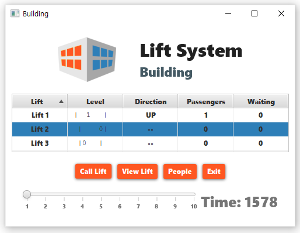
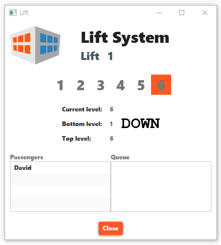
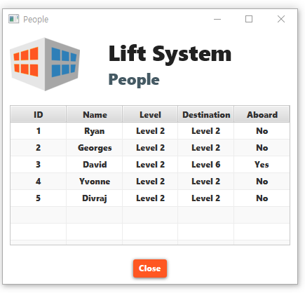

# lift-system
Simple object-oriented MVC JavaFX application for 48024 Applications Programming.

To run, you'll need JavaFX library available from here: 
https://openjfx.io/openjfx-docs/#introduction

## Preview

* Building View

  

* Lift View

  

* People View

  

